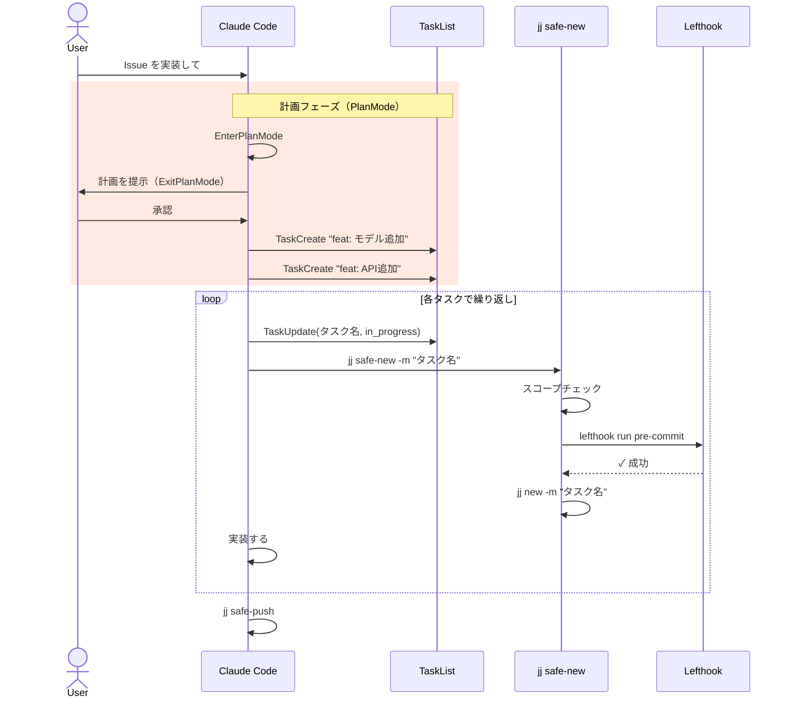

# Change 単一責任ワークフロー

AI エージェント（Claude Code）に実装させると、すべての変更が 1 つの巨大なコミットにまとまりがち。
**1 Change = 1 責任範囲** を構造的に維持するためのワークフロー。

## コアコンセプト

| フェーズ | Claude Code の動き |
|---|---|
| **計画（PlanMode）** | 1. Issue を原子的な Change に分解 2. TaskCreate でタスクを可視化 3. ユーザー承認を得る |
| **実行** | 1. Change の責任範囲を宣言 2. 実装 3. `jj safe-new` でスコープ・品質チェック → 次の Change |
| **Push** | `jj safe-push` で最終チェック → push |

## セットアップ

```bash
# プロジェクトを初期化（rules ファイル配置・Lefthook 設定）
/jj-init
```

`jj safe-new` / `jj safe-push` は外部ツール
[jj-exec-aliases](https://github.com/UtakataKyosui/jj-exec-aliases) が提供する（別途導入）。

→ 詳細: [../references/installation.md](../references/installation.md)

## スコープマニフェストの作成

計画フェーズで Claude が生成するスコープマニフェスト:

```json
{
  "feat: User modelとDBスキーマを追加": [
    "src/models/user.ts",
    "prisma/schema.prisma"
  ],
  "feat: 認証APIエンドポイントを追加": [
    "src/api/auth.ts"
  ]
}
```

- キーは `jj describe -m "..."` の description と完全一致させる
- `jj safe-new` が description をキーにルックアップしてスコープを特定する
- `issue-driven-flow:change-planner` エージェントに Issue を渡すと自動生成できる

→ 詳細: [../references/scope-manifest.md](../references/scope-manifest.md)

## jj safe-new の使い方

```bash
# Change 境界を越える（スコープチェック → jj fix → jj new）
jj safe-new -m "feat: 認証APIエンドポイントを追加"

# 失敗した場合は実装を修正して再実行
```

フローは以下:
1. `jj safe-new` が共有スコープマニフェストをチェック → スコープ外ファイルがあれば exit 1
2. `jj fix` で `fix.tools.lefthook`（Lefthook pre-commit）を実行 → 失敗で exit 1
3. `jj new "$@"` で次の Change を作成

## jj safe-push の使い方

```bash
# Push 前の最終品質チェック
jj safe-push

# 引数はそのまま jj git push に転送される
jj safe-push -b feat/my-feature
```

フローは以下:
1. `@..remote_bookmarks()` で diverge チェック → 未 fetch なら exit 1
2. `conflicts()` で conflict チェック → conflict があれば exit 1
3. `lefthook run pre-push` → 失敗で exit 1（lefthook.yml 存在時のみ）
4. `jj git push --dry-run` → 内容確認
5. 確認後 `jj git push`

## ガード機構

`jj new` / `jj git push` の代わりに `jj safe-new` / `jj safe-push` alias を使う（スコープチェック＋品質チェックを経由する）。
[jj-exec-aliases](https://github.com/UtakataKyosui/jj-exec-aliases) のシェルラッパーを導入すると、ターミナルでの `jj new` / `jj git push` も
`jj safe-new` / `jj safe-push` へ透過リダイレクトされる:

- `jj new` → `jj safe-new` へリダイレクト
- `jj git push` → `jj safe-push` へリダイレクト
- `jj safe-new` / `jj safe-push` / `command jj ...` → そのまま実行

## Change 境界の作成

各タスクの着手時に `jj safe-new -m "<タスク名>"` を実行して Change 境界を作る:

- 現在の Change description がタスク名と一致しなければ `jj safe-new -m "<title>"` を実行する
- 一致する場合はスキップ（二重作成防止）

> かつては `PostToolUse(TaskUpdate)` フック（`jj-task-start.sh`）が自動実行していたが、
> jj 専用 hook は Issue #19 で削除した。現在は明示的に `jj safe-new` を呼ぶ運用とする。

## フロー全体図



## bypassPermissions モードについて

→ [../references/bypass-permissions.md](../references/bypass-permissions.md)
